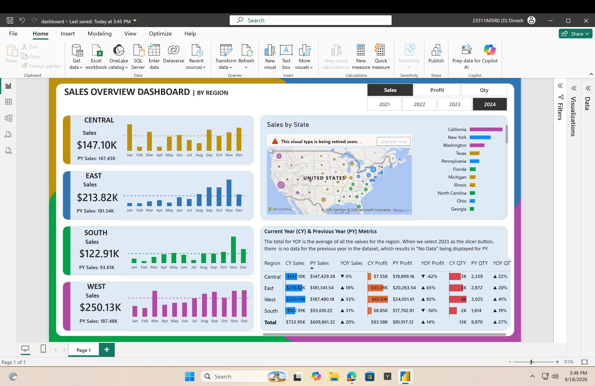
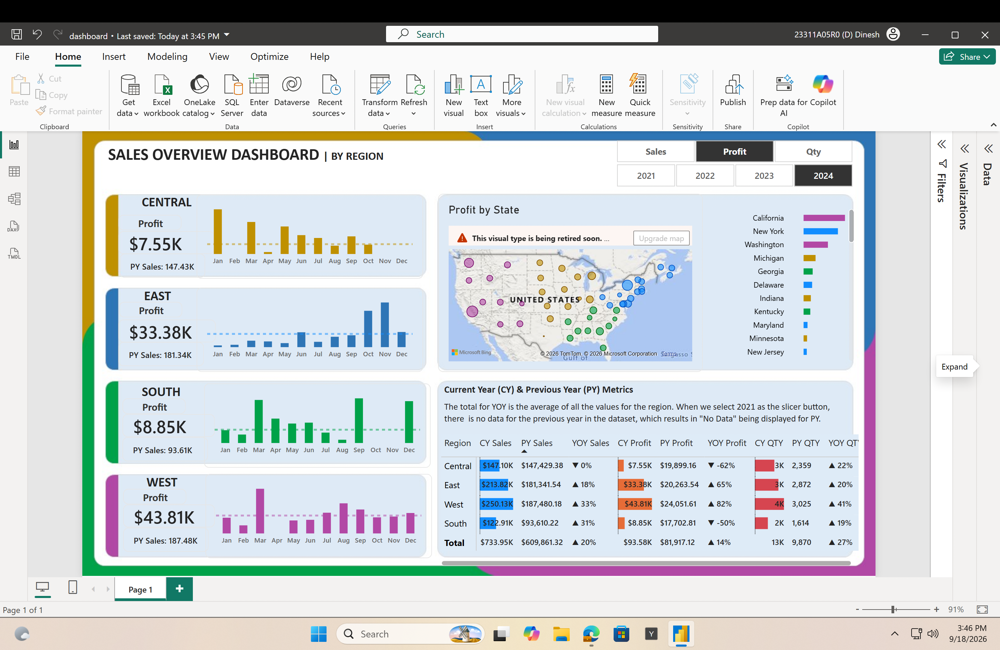
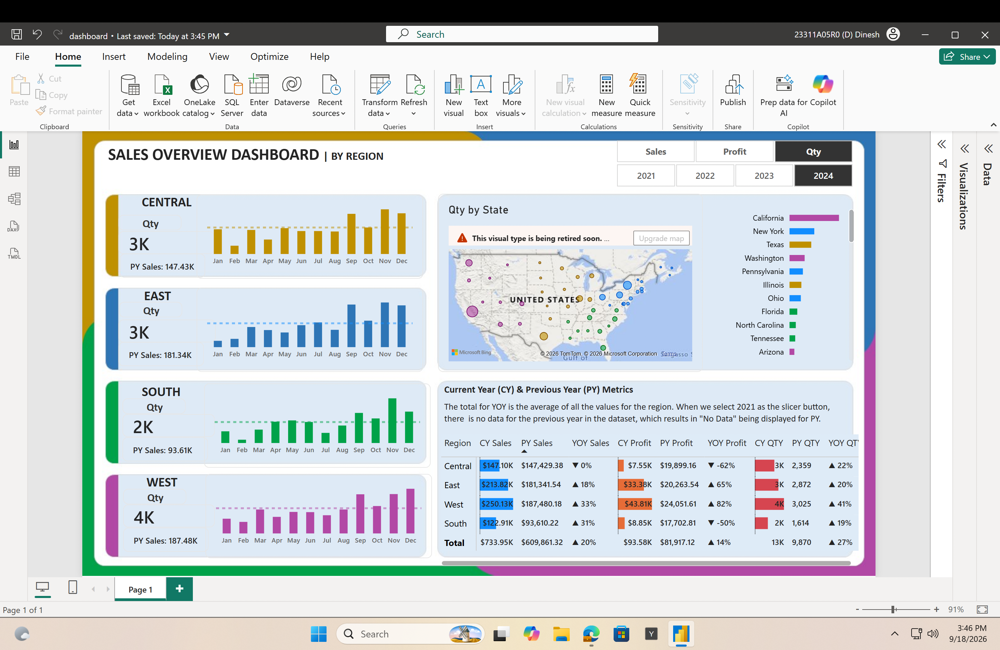

# Superstore Sales Analytics Dashboard

## 📊 Project Overview

An interactive Power BI dashboard designed to analyze sales,
profit, quantity, regional performance, and year-over-year trends.

## 🛠️ Tools Used

- Power BI
- DAX
- Power Query
- Excel/CSV
- Kaggle Superstore Dataset

## ✨ Dashboard Features

- Dynamic Sales / Profit / Quantity analysis
- Year-wise filtering
- Regional performance analysis
- State-wise analysis
- Current Year (CY) vs Previous Year (PY) metrics
- YOY analysis
- Interactive dashboard filters
- Dynamic dashboard titles

## 📈 Key Analysis

The dashboard provides insights into:

- Sales performance
- Profitability
- Quantity sold
- Regional performance
- State-level performance
- Year-over-year changes

## 👨‍💻 My Contribution

I performed the data preparation, created the data model,
developed DAX measures, designed the dashboard, and implemented
interactive filters and dynamic metrics.

## 📷 Dashboard Preview

## 🔗 Power BI Report

[View Interactive Power BI Dashboard](https://app.powerbi.com/groups/me/reports/a60a2832-1188-4b10-88b9-53677bfbb0e0/2c4ad9b2846106912165?experience=power-bi)

## 📁 Project Files

- `dashboard.pbix` — Power BI dashboard
- `sales-overview-dashboard.png` — Dashboard preview
- `profit-analysis-dashboard.png` — Profit analysis
- `quantity-analysis-dashboard.png` — Quantity analysis

## 📌 Dataset

Superstore dataset sourced from Kaggle.
